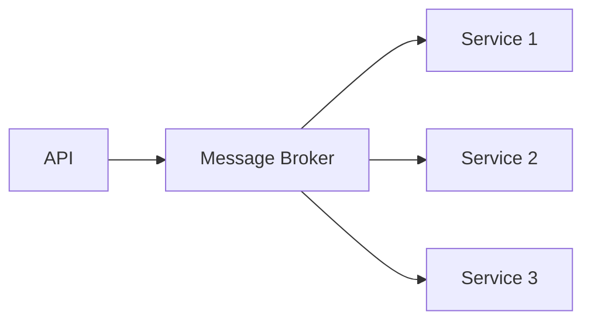

# RFC-001: Migração para Event-Driven Architecture

## Contexto
Precisamos escalar nosso sistema...

## Arquitetura Proposta

## Decisões
- Usar Kafka como message broker
- [[Event Sourcing]] pattern