# Mermaid Diagrams - Guia de Referência Rápida

Este documento contém exemplos de todos os tipos de diagramas Mermaid úteis para documentação técnica(utils).

---

## 1. Flowchart (Fluxograma)

**Uso:** Fluxos de decisão, lógica de negócio, processos

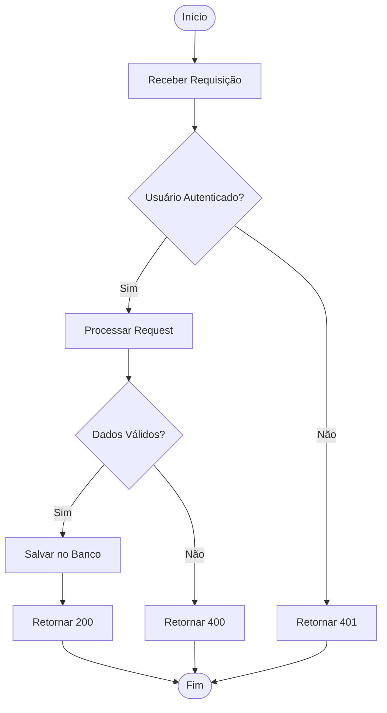

**Direções disponíveis:**

- `TD` (Top Down - de cima para baixo)
- `LR` (Left to Right - esquerda para direita)
- `RL` (Right to Left)
- `BT` (Bottom to Top)

---

## 2. Sequence Diagram (Diagrama de Sequência)

**Uso:** Interações entre sistemas, APIs, comunicação entre serviços

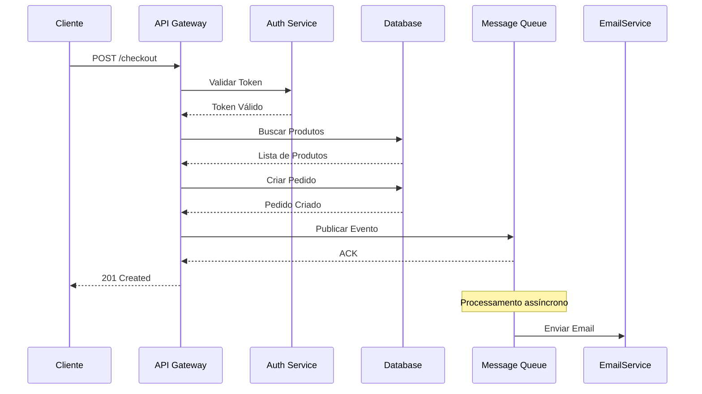

**Tipos de setas:**

- `->` Linha sólida sem seta
- `-->` Linha tracejada sem seta
- `->>` Linha sólida com seta
- `-->>` Linha tracejada com seta (resposta)
- `-x` Linha com X no final
- `-)` Linha assíncrona

---

## 3. Class Diagram (Diagrama de Classes)

**Uso:** Modelagem orientada a objetos, estrutura de classes

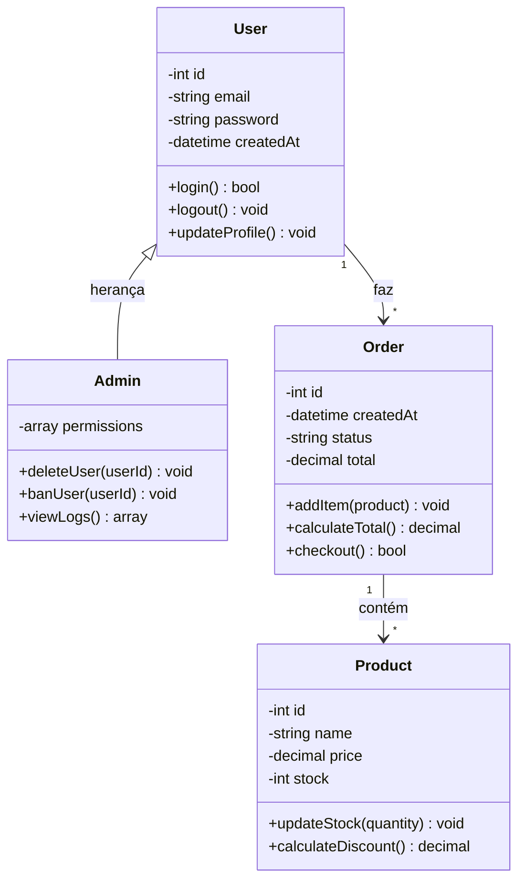

**Relacionamentos:**

- `<|--` Herança
- `*--` Composição
- `o--` Agregação
- `-->` Associação
- `--` Link
- `..>` Dependência
- `..|>` Realização

**Visibilidade:**

- `+` Public
- `-` Private
- `#` Protected
- `~` Package

---

## 4. Entity Relationship Diagram (Diagrama ER)

**Uso:** Modelagem de banco de dados, relacionamentos entre tabelas

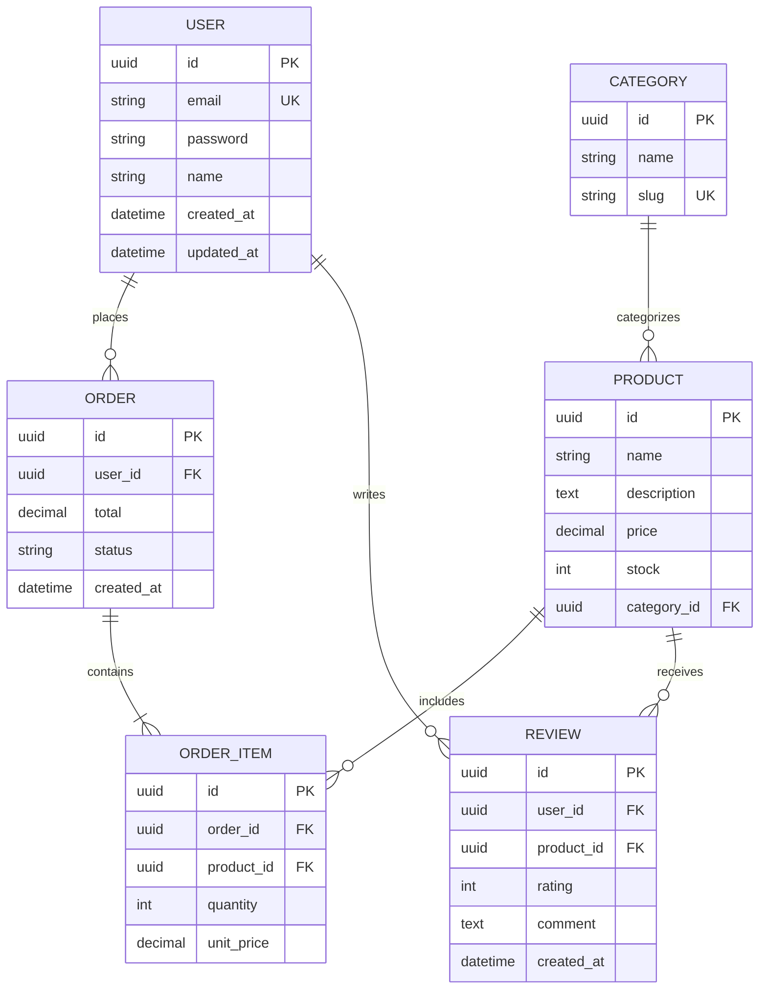

**Cardinalidade:**

- `||--||` Um para um
- `||--o{` Um para zero ou muitos
- `||--|{` Um para um ou muitos
- `}o--o{` Zero ou muitos para zero ou muitos

---

## 5. State Diagram (Diagrama de Estados)

**Uso:** Ciclo de vida de entidades, máquina de estados

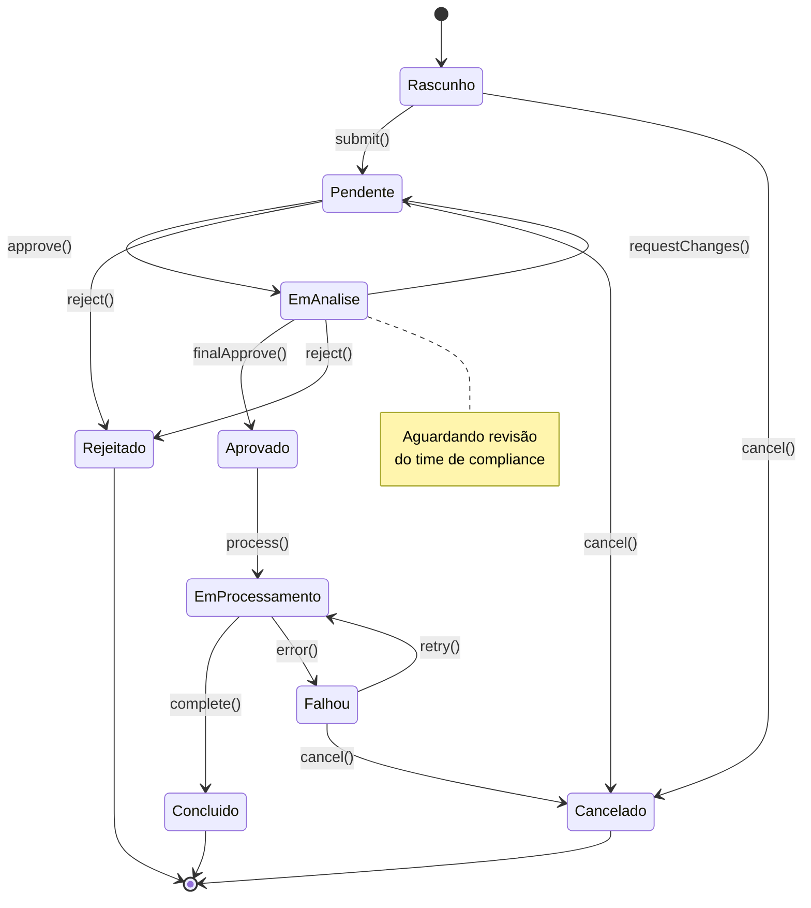

---

## 6. Gantt Chart (Cronograma)

**Uso:** Planejamento de sprints, roadmaps, timelines de projeto

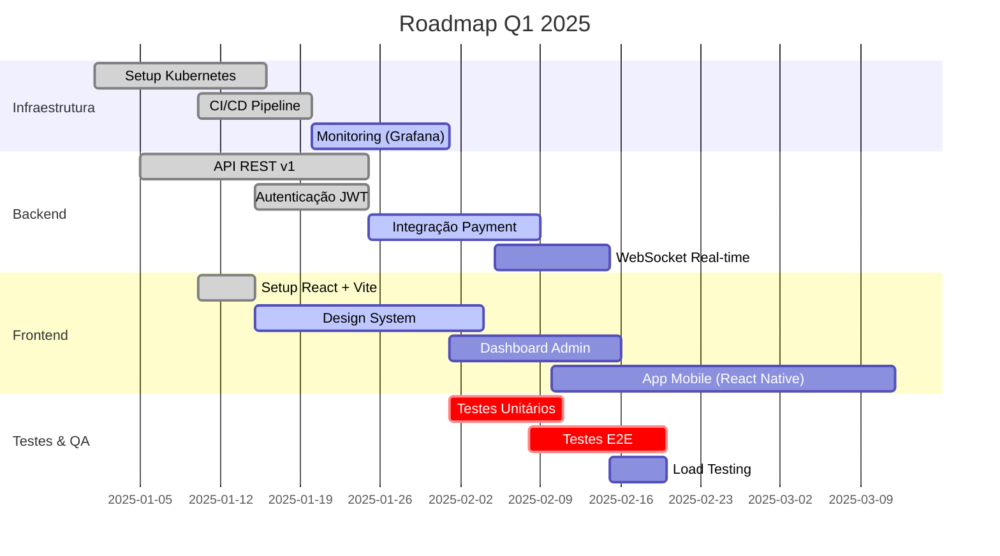

---

## 7. Git Graph (Fluxo Git)

**Uso:** Documentar estratégia de branching, fluxo de trabalho Git

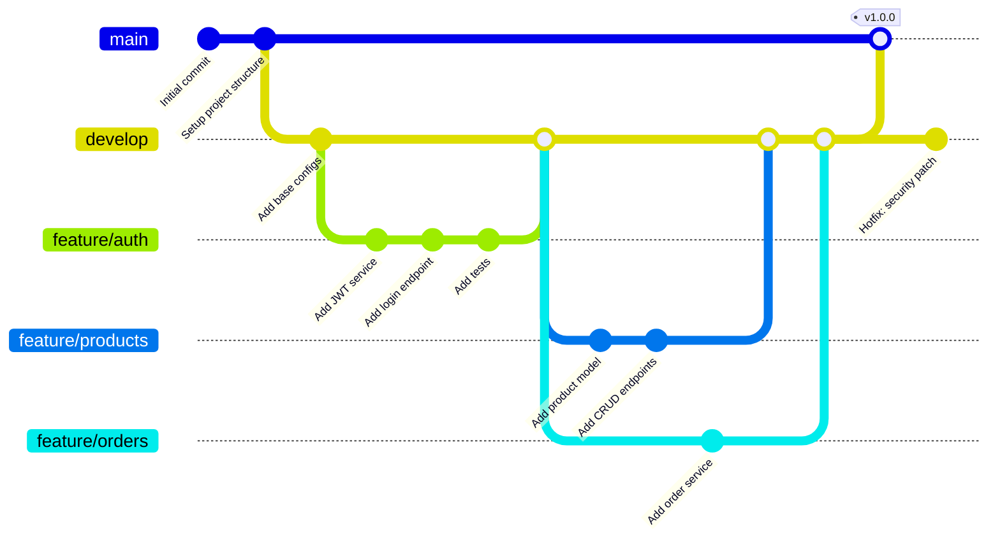

---

## 8. Pie Chart (Gráfico de Pizza)

**Uso:** Distribuição percentual, métricas

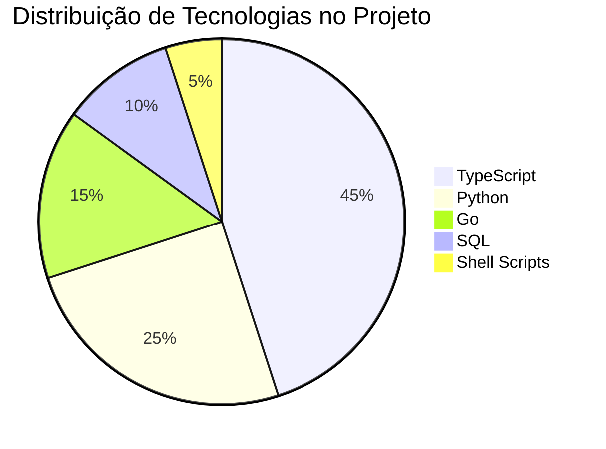

---

## 9. Journey Diagram (Jornada do Usuário)

**Uso:** User experience, fluxo de usuário

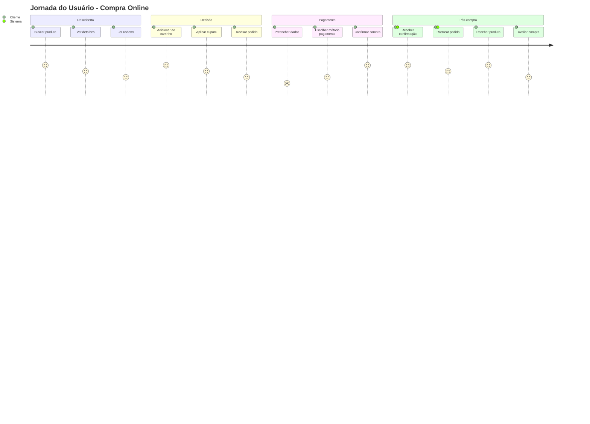

---

## 10. Quadrant Chart

**Uso:** Priorização, análise de features

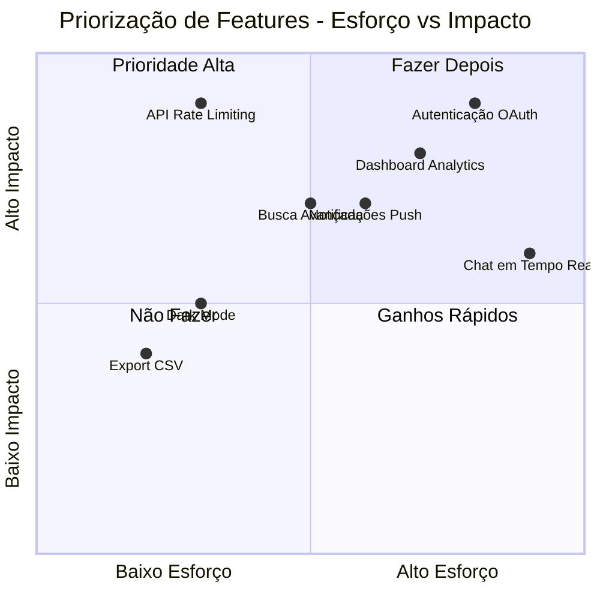

---

## 11. Architecture Diagram (C4 Model Style)

**Uso:** Arquitetura de sistemas, visão macro

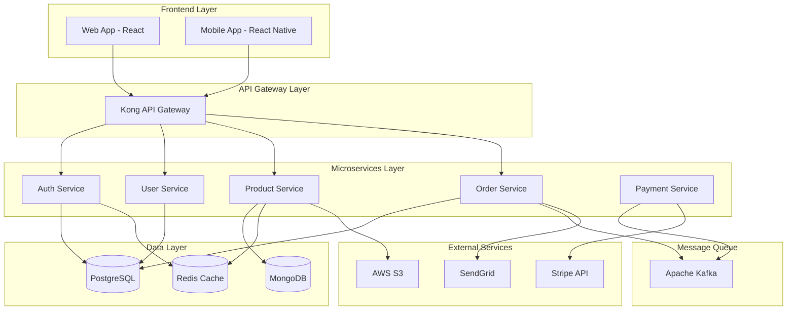

---

## 12. Mindmap

**Uso:** Brainstorming, estruturação de ideias

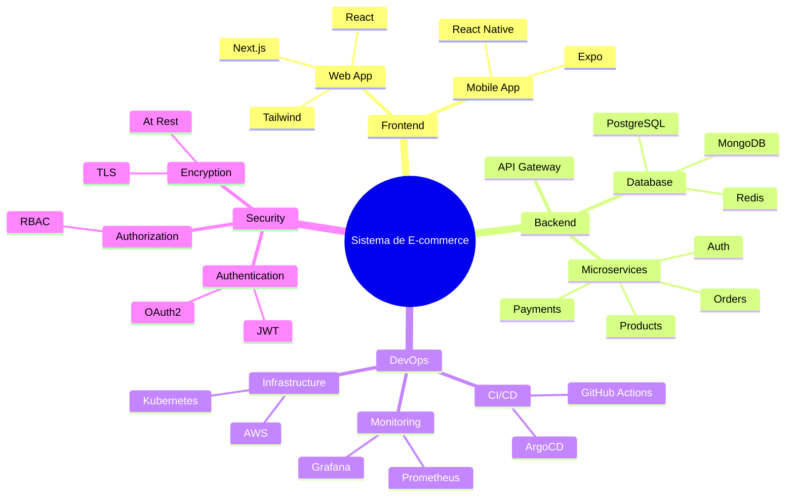

---

## Dicas Importantes

### Performance

- Evite diagramas muito grandes (máximo 50-60 nós)
- Para sistemas complexos, divida em múltiplos diagramas

### Estilo e Formatação

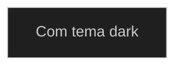

### Links Clicáveis

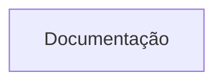

### Comentários

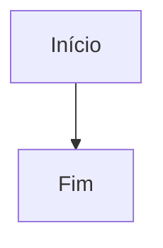

---

## Template para RFCs

Use este template ao criar RFCs:

```markdown
# RFC-XXX: [Título]

## Status
- [ ] Em Discussão
- [ ] Aprovado
- [ ] Implementado
- [ ] Rejeitado

## Contexto
[Descreva o problema ou necessidade]

## Proposta

### Arquitetura Atual
[Diagrama Mermaid da arquitetura atual]

### Arquitetura Proposta
[Diagrama Mermaid da nova arquitetura]

### Fluxo de Dados
[Sequence diagram do fluxo]

## Alternativas Consideradas
1. [Alternativa 1]
2. [Alternativa 2]

## Decisões
- [Decisão 1]
- [Decisão 2]

## Impacto
- **Performance**: 
- **Segurança**: 
- **Custo**: 

## Riscos
- [Risco 1]

## Timeline
[Gantt chart]

## Referências
- [[Link para ADR relacionado]]
- [[Link para documentação]]
```

---

**Última atualização:** 2025-01-06